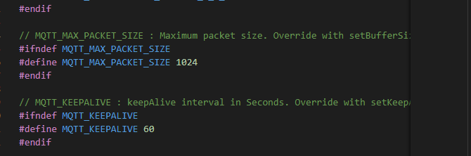

# 使用esp32连接MQTT服务器

## 使用Arduino库

- PubSubClient.h

修改PubSubClient.h文件



## 基本初始化

- 引入头文件

`#include "PubSubClient.h"`


```c
const char*ssid ="XXXX";               //ESP32连接的WiFi账号
const char*password =  "XXXX";        //WiFi密码
const char*mqttServer = "XXXX";  //要连接到的服务器IP
const int mqttPort =1883;                 //要连接到的服务器端口号
const char*mqttUser = "admin";            //MQTT服务器账号
const char*mqttPassword = "public";       //MQTT服务器密码
```

```c
WiFiClient espClient;                     // 定义wifiClient实例
PubSubClient client(espClient);          // 定义PubSubClient的实例
```

## 接收信息函数

```c
void callback(char*topic, byte* payload, unsigned int length) 
{
    tft.drawString("From MQTT",0,48,2);             
    tft.drawString(topic,0,60,2);               
    tft.drawString("Massage is :",0,68,2);            
    char arr[length];
    for (int i = 0; i< length; i++)           //使用循环打印接收到的信息
    {
        arr[i] = (char)payload[i]; // 接收信息
    }
    
    tft.drawString(arr,0,80,2); // 屏幕打印信息

}
```

## 连接WiFi

```c
delay(500);
  WiFi.begin("Internet Of Things Skills", "ThingInternets@fSkillsB44752");
  while (WiFi.status() != WL_CONNECTED) {
    delay(500);
    Serial.print(".");
  }
```

## MQTT初始化

```c

client.setServer(mqttServer,mqttPort);
client.setCallback(callback); 

while (!client.connected())             //是否连接上MQTT服务器
    {
            
        if (client.connect("ESP32Client",mqttUser, mqttPassword ))  //如果服务器连接成功
        {
            State = 2;
        }
    }

    client.subscribe("ESP32");                 //连接MQTT服务器后订阅主题
    client.publish("/World","Hello from ESP32");//向服务器发送的信息(主题，内容)


}
```

## 接收

```c
 client.loop();                              //回旋接收函数  等待服务器返回的数据
```

参考

[ESP32连接MQTT服务器（基于Arduino环境）_- 猪猪猪的博客-CSDN博客_esp32 mqtt](https://blog.csdn.net/zhuweiyaa/article/details/104780096)