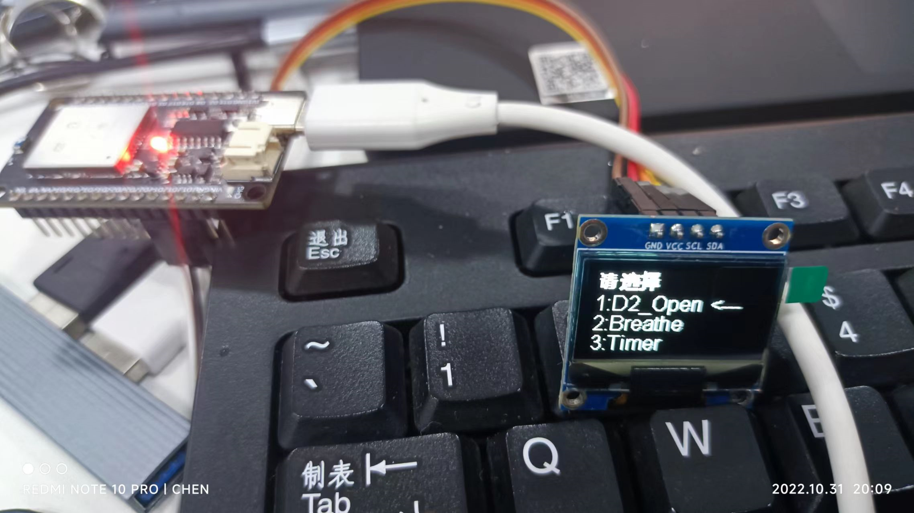
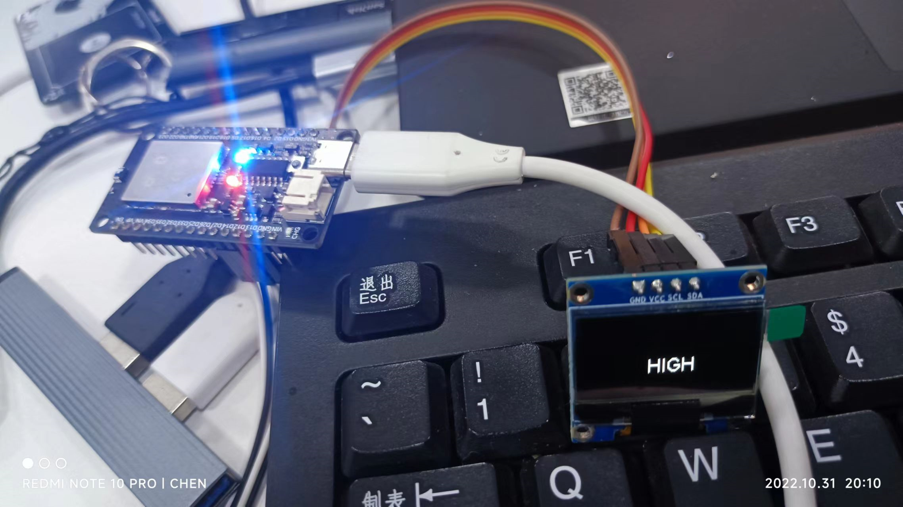
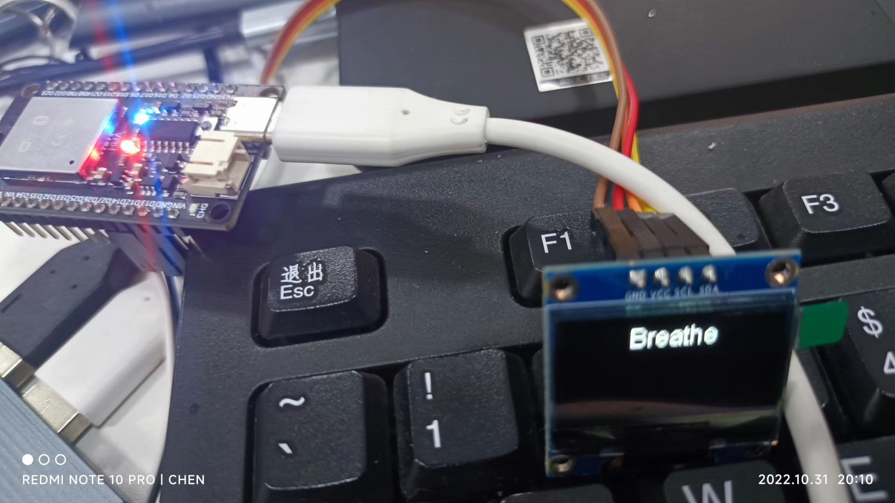
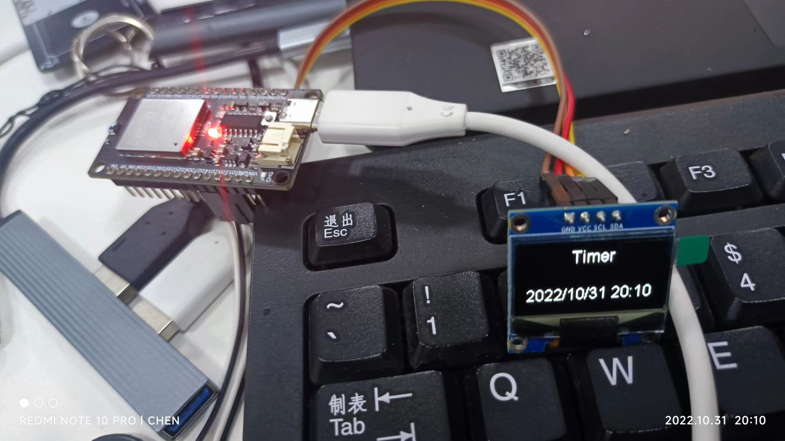

# esp32 OLED和呼吸灯









## 代码

```c
#include <Wire.h>
#include "SSD1306.h"

#include <WiFi.h>
#include <TimeLib.h>
#include <NtpClientLib.h>
//设置时区为东8
int8_t timeZone = 8;
//设置时间服务器为阿里云的
const PROGMEM char *ntpServer = "ntp1.aliyun.com";


SSD1306Wire display(0x3c, 21, 18);//实例化屏幕

void Breath();//呼吸灯的函数
void OLED_State();//灯状态
unsigned char State = 0;//屏幕状态
unsigned char Z = 1; //’<‘标志位置
unsigned char flag = 0;
// 图片取模  ps:找不到中文取模的库函数
unsigned char QXZ[3][32] = {
{0x00,0x00,0x00,0x00,0x44,0x00,0xDC,0x1F,0xD8,0x1F,0xB8,0x18,0xA8,0x3F,0xA8,0x3F,
0xFC,0x0A,0xFC,0x2A,0xFC,0x2A,0xA8,0x3F,0xA8,0x3F,0xA8,0x1F,0x80,0x00,0x00,0x00},/*"C:\Users\chen\Desktop\请.bmp",0*/

{0x00,0x00,0xC0,0x20,0xCC,0x70,0xDC,0x3F,0xF8,0x3F,0xD8,0x31,0xF8,0x6D,0xFC,0x6F,
0xF8,0x6F,0xFE,0x61,0xFC,0x61,0xF8,0x6F,0xF8,0x69,0xF8,0x6F,0xD8,0x6F,0x00,0x00},/*"C:\Users\chen\Desktop\选.bmp",0*/

{0x18,0x63,0x18,0x63,0xFF,0x7F,0xFE,0x3F,0xD8,0x09,0xD6,0x0F,0xCE,0x0B,0x7E,0x0B,
0xF6,0x7F,0xF6,0x7F,0x7E,0x0B,0x7E,0x0B,0xCE,0x0F,0x40,0x0C,0x00,0x00,0x00,0x00},/*"C:\Users\chen\Desktop\择.bmp",0*/
  };

//触摸引脚中断
void gotTouch12() {

  if(touchRead(12) <= 40){
    delay(30);//消除抖动
    if(touchRead(12) <= 40){
      while(touchRead(12) <= 40);
    if(Z != 3)
      Z++;
      
    }
    }

}

void gotTouch13() {
     if(touchRead(13) <= 40){
    delay(30);//消除抖动
    if(touchRead(13) <= 40){
      while(touchRead(13) <= 40);
      if(Z != 1)
      Z--;
      
    }
    }

}

void gotTouch14() {
     if(touchRead(14) <= 40){
    delay(30);//消除抖动
      if(touchRead(14) <= 40){
        while(touchRead(14) <= 40);


        
        if(State != Z)//设置屏幕状态
        State = Z;
          else
        State = 0;

        display.clear();


    
      

        
      }
    }


}


/******************************************************main***************************************************/
void setup() {
//触摸中断
  touchAttachInterrupt(12,gotTouch12, 40);
  touchAttachInterrupt(13,gotTouch13, 40);
  touchAttachInterrupt(14,gotTouch14, 40);
//WiFi初始化
 WiFi.begin("Internet Of Things Skills", "ThingInternets@fSkillsB44752");
  while (WiFi.status() != WL_CONNECTED) {
    delay(500);
    Serial.print(".");
  }
//时间同步间隔为600ms
  NTP.setInterval (600);
  NTP.setNTPTimeout (1500);
  NTP.begin (ntpServer, timeZone, false);


  display.init();//屏幕初始化
  //display.invertDisplay();//反色显示屏幕
  display.setBrightness(255);//设置屏幕亮度
   pinMode(2,OUTPUT);//设置2号引脚为输出
  display.flipScreenVertically();//显示屏垂直翻转
    Serial.begin(9600);//串口初始化
    

 

}

void loop() {

 OLED_State();


}


void OLED_State(){
  display.display();
  if(State == 0){
    display.clear();
    digitalWrite(2,LOW);
      display.setFont(ArialMT_Plain_16);
      display.drawFastImage(0,0,16,16,QXZ[0]);
      display.drawFastImage(16,0,16,16,QXZ[1]);
      display.drawFastImage(32,0,16,16,QXZ[2]);
    display.drawString(0,16,"1:D2_Open");
    display.drawString(0,32,"2:Breathe");
    display.drawString(0,48,"3:Timer");
    display.drawString(128-40,(Z)*16,"<---");
    //display.invertDisplay(); //反色显示
    
  }
if(State == 1){
    display.clear();
    display.drawString((128-32)/2,32,"HIGH");
    digitalWrite(2,HIGH);
  }

  if(State == 2){
display.clear();
display.drawString((128-56)/2,0,"Breathe");
display.display();
    Breath(3000);

  }

if(State == 3){
/*
  NTP.getDateYear();

  NTP.getDateMonth();

  NTP.getDateDay();

  NTP.getTimeHour24();

  NTP.getTimeMinute();*/
 char arr[20];
sprintf(arr,"%d/%d/%d %d:%d",NTP.getDateYear(),NTP.getDateMonth(),\
NTP.getDateDay(),NTP.getTimeHour24(),NTP.getTimeMinute());
  display.clear();
  display.drawString((128-40)/2,0,"Timer");
  display.drawString(0,40,arr);
  display.display();
  }

  
}
/******************************************************************************************************************/


void Breath(unsigned int time ){
    unsigned int i,j;
    for(i = 0;i < time ;i++){
      for(j = 0;j < i ;j++){
          digitalWrite(2,HIGH);
        }
      for(j = 0;j < time - i;j++){
          digitalWrite(2,LOW);
        }
        
      }

    for(i = 0;i < time ;i++){
      for(j = 0;j < i ;j++){
          digitalWrite(2,LOW);
        }
      for(j = 0;j < time - i;j++){
          digitalWrite(2,HIGH);
        }
        
      }
      
}

  
```

