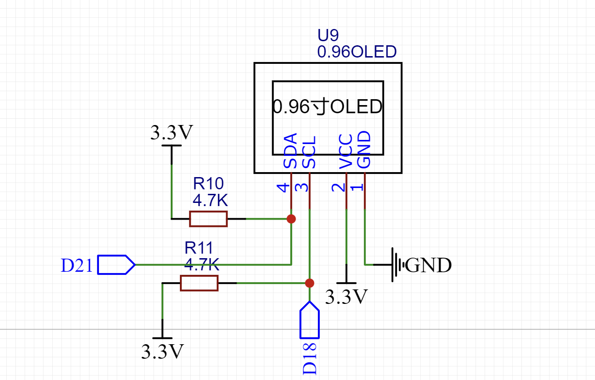
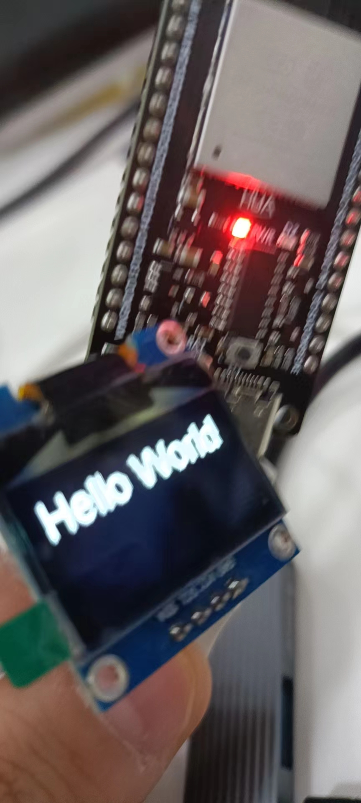

# esp32点亮4pinOLED屏幕


## 接线方法

**屏幕是4pin的使用iic的协议**使用SSD1306屏库



## 测试代码

```c
#include <Wire.h>
#include "SSD1306.h"

SSD1306 display(0x3c, 21, 18);

void setup() {
  display.init();

  display.setFont(ArialMT_Plain_24);
  display.drawString(0, 0, "Hello World");
  display.display();
}

void loop() {
 
}

```


## 实现效果



## **相关屏库库函数**

#### 实例化一个SSD1306Wire对象

```scss
SSD1306Wire display(0x3c, 21, 22);
```

#### 初始化屏幕

```scss
display.init();
```

#### 显示和清除

```scss
display.clear();
display.display();
```

#### 清除某个点 `display.clearPixel`

```scss
void OLEDDisplay::clearPixel(int16_t x, int16_t y)
```

####  显示, 显示buf区的内容 `display.display`

```scss
void SSD1306Wire::display()
```

4. 把显示屏关掉 display.displayOff();
5. 把显示屏打开 display.displayOn();
6. 深度睡眠后恢复 display.allocateBuffer();
//使用它可以在深度睡眠后恢复而不重置显示（init（）会做什么）。
//如果已建立与显示器的连接并分配了缓冲区，则返回true，否则返回false。

```scss
display.allocateBuffer();
```

#### 屏幕垂直翻转 display.flipScreenVertically();

```scss
display.flipScreenVertically();
```

#### 屏幕镜像显示 display.mirrorScreen();

```scss
display.mirrorScreen();
```

#### 反色显示 display.invertDisplay();

```scss
display.invertDisplay();
```

#### 回归正常显示 display.normalDisplay();

```scss
display.normalDisplay();
```

#### 重新初始化display.resetDisplay();

```scss
display.resetDisplay();
```

#### 重置显示方向 display.resetOrientation();

```scss
display.resetOrientation();
```

#### 设置显示亮度 display.setBrightness();

```scss
void OLEDDisplay::setBrightness(uint8_t)
```

#### 设置对比度 display.setContrast();

```scss
void OLEDDisplay::setContrast(uint8_t contrast, uint8_t precharge = (uint8_t)'�', uint8_t comdetect = (uint8_t)'@')
```

## 绘制相关库函数

#### 设置一个点 display.setPixel

```scss
void OLEDDisplay::setPixel(int16_t x, int16_t y)
```

#### 画空心圆 display.drawCircle

```scss
void OLEDDisplay::drawCircle(int16_t x, int16_t y, int16_t radius)
```

#### 画实心圆 display.fillCircle

```scss
void OLEDDisplay::fillCircle(int16_t x, int16_t y, int16_t radius)
```

#### 画1/4圆弧 display.drawCircleQuads

```scss
void OLEDDisplay::drawCircleQuads(int16_t x0, int16_t y0, int16_t radius, uint8_t quads)//其中: quads是角度
```

| quads | 左上 | 右上 | 左下 | 右下 |
| :---- | :--- | :--- | :--- | :--- |
| 0     |      |      |      |      |
| 1     |      | ✔    |      |      |
| 2     | ✔    |      |      |      |
| 3     | ✔    | ✔    |      |      |
| 4     |      |      | ✔    |      |
| 5     |      | ✔    | ✔    |      |
| 6     | ✔    |      | ✔    |      |
| 7     | ✔    | ✔    | ✔    |      |
| 8     |      |      |      | ✔    |
| 9     |      | ✔    |      | ✔    |
| 10    | ✔    |      |      | ✔    |
| 11    | ✔    | ✔    |      | ✔    |
| 12    |      |      | ✔    | ✔    |
| 13    |      | ✔    | ✔    | ✔    |
| 14    | ✔    |      | ✔    | ✔    |
| 15    | ✔    | ✔    | ✔    | ✔    |

#### 画水平线 display.drawHorizontalLine

```scss
void OLEDDisplay::drawHorizontalLine(int16_t x, int16_t y, int16_t length)
```

#### 画垂直线 display.drawVerticalLine

```scss
void OLEDDisplay::drawVerticalLine(int16_t x, int16_t y, int16_t length)
```

#### 画线 display.drawLine

```scss
void OLEDDisplay::drawLine(int16_t x0, int16_t y0, int16_t x1, int16_t y1)
```

#### 画空心矩形 display.drawRect

```scss
void OLEDDisplay::drawRect(int16_t x, int16_t y, int16_t width, int16_t height)
```

#### 画实心矩形 display.fillRect

```scss
void OLEDDisplay::fillRect(int16_t x, int16_t y, int16_t width, int16_t height)
```

#### 画进度条 display.drawProgressBar

```scss
void OLEDDisplay::drawProgressBar(uint16_t x, uint16_t y, uint16_t width, uint16_t height, uint8_t progress)
```

## 文本相关库函数

#### 设置字体 display.setFont

```scss
void OLEDDisplay::setFont(const uint8_t *fontData)
```

| 内建字体  字体大小一般为16 | 字高 | 字宽 | 包含字符  |
| :------------------------- | :--- | :--- | :-------- |
| ArialMT_Plain_10           | 13   | 10   | 224个字符 |
| ArialMT_Plain_16           | 19   | 16   | 224个字符 |
| ArialMT_Plain_24           | 28   | 24   | 224个字符 |

#### 设置文本对齐方法 display.setTextAlignment()

```scss
void OLEDDisplay::setTextAlignment(OLEDDISPLAY_TEXT_ALIGNMENT textAlignment)
```

对齐方法有:

| 对齐方法               | 描述         |
| :--------------------- | :----------- |
| TEXT_ALIGN_LEFT        | 左对齐       |
| TEXT_ALIGN_RIGHT       | 右对齐       |
| TEXT_ALIGN_CENTER      | 居中对齐     |
| TEXT_ALIGN_CENTER_BOTH | 上下左右对齐 |

#### 绘制字符串 display.drawString

```scss
void OLEDDisplay::drawString(int16_t x, int16_t y, String text)
```

### 绘制字符串(带最大宽度) display.drawStringMaxWidth

到达最大宽度回换行显示

## 图像相关

#### 显示16*16的图标 display.drawIco16x16

```scss
void OLEDDisplay::drawIco16x16(int16_t x, int16_t y, const char *ico, bool inverse = false)
```

#### 显示XBM图像 display.drawXbm

```scss
void OLEDDisplay::drawXbm(int16_t x, int16_t y, int16_t width, int16_t height, const uint8_t *xbm)
```

#### 显示BMP位图图像 display.drawFastImage (未实验)

```scss
void OLEDDisplay::drawFastImage(int16_t x, int16_t y, int16_t width, int16_t height, const uint8_t *image)
```


[参考]: https://blog.csdn.net/finedayforu/article/details/108769900


[参考]: https://blog.csdn.net/qq_28877125/article/details/99616323